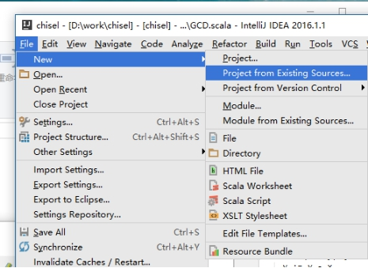
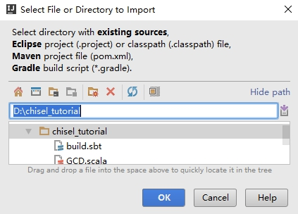
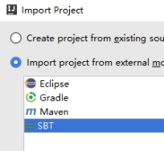
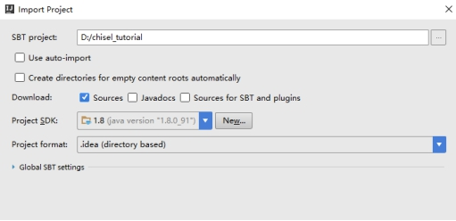
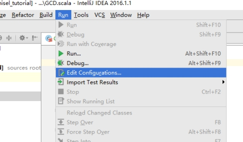
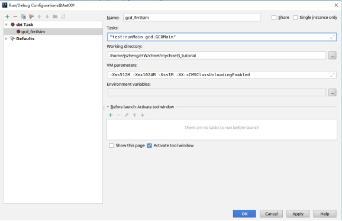
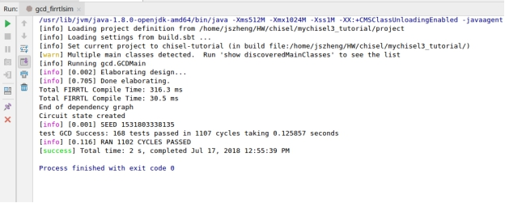
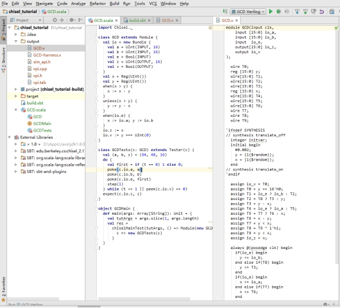

# Using IDEA for chisel development

在工作目录下放置scala source文件和build.sbt

 在此之上创建新项目

 

 

 

 

选择导入SBT项目

 

 

 

build产生Verilog文件，需要构建新的sbt task

 

+新建一个SBT task，如下设置

 

 

可以看到右上方出现刚才的设置。

 

点运行按钮

 

在output有verilog文件出现了

 

  

 