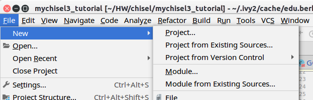
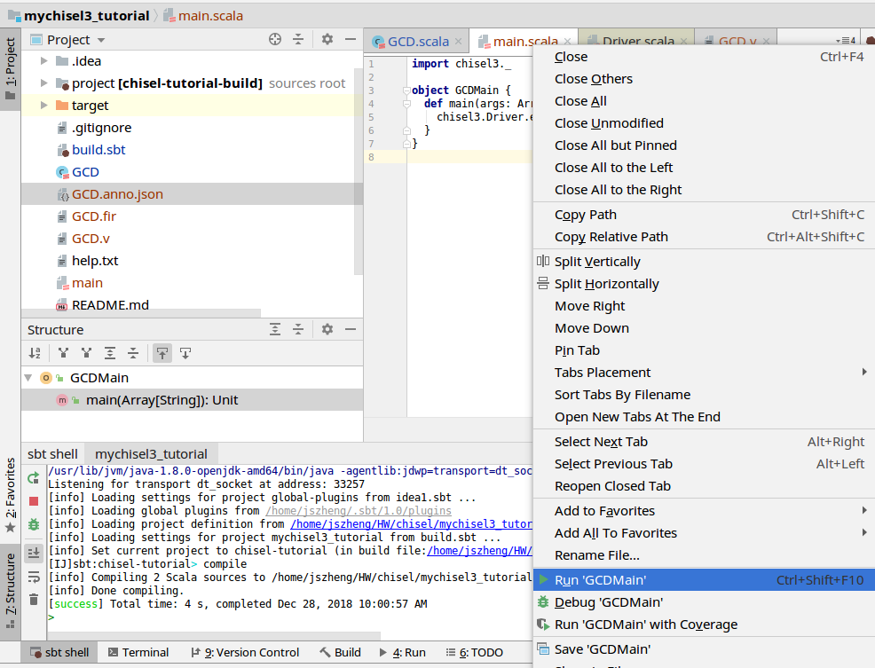

# Introduction

这里介绍如何快速上手Chisel

# Install
Chisel 是基于scala的internal DSL，所以首先确认系统中安装了JDK，Scala，SBT。


Sbt需要做版本检查，下载很多的依赖文件，连国外比较困难，需要找中国镜像。
```bash
# 在自己home目录创建如下文件，使用ali的镜像可以大大缩短下载时间
# 下载失败就不停打命令重做
% cat ~/.sbt/repositories

[repositories]
local
aliyun: http://maven.aliyun.com/nexus/content/groups/public
typesafe: http://repo.typesafe.com/typesafe/ivy-releases/, [organization]/[module]/(scala_[scalaVersion]/)(sbt_[sbtVersion]/)[revision]/[type]s/[artifact](-[classifier]).[ext], bootOnly
sonatype-oss-releases
maven-central
sonatype-oss-snapshots
```

# 设置project

Sync一个template来开始你的project
```bash
git clone https://github.com/freechipsproject/chisel-template
```
然后按照可以运行他的demo。按照规范每一个设计需要有个design和对应的unit test. 要求分别放在./src下的
```
main/scala/
test/scala/
```
通常还有scala的包的概念，当你把源代码放在一个包里面，除了在源代码中写
```scala
package gcd
import chisel3._
```
还要将其放在对应包名的子目录下。也就是
```
main/scala/gcd
test/scala/gcd
```
这很软件，好啰嗦。硬件工程师很平坦，不喜欢这样，现在我们只想看看产生的verilog是什么样子的。我们修改一下：


注意到其实项目中最重要的其实只是一个文件而已

https://github.com/freechipsproject/chisel-template/blob/release/build.sbt

你可以拷贝到任何一个工作目录就可以了。里面内容可以先不管。

为了快速写代码，使用jetbrain的拳头产品IntelliJ IDEA装上scala plugin后，创建一个新的Project from Existing Sources...



# GCD Example

然后就可以开心的写scala文件了。先写设计 GCD.scala，基本上是copy原始文件，把package去掉了。

```scala
import chisel3._

/**
  * Compute GCD using subtraction method.
  * Subtracts the smaller from the larger until register y is zero.
  * value in register x is then the GCD
  */
class GCD extends Module {
  val io = IO(new Bundle {
    val value1        = Input(UInt(16.W))
    val value2        = Input(UInt(16.W))
    val loadingValues = Input(Bool())
    val outputGCD     = Output(UInt(16.W))
    val outputValid   = Output(Bool())
  })

  val x  = Reg(UInt())
  val y  = Reg(UInt())

  when(x > y) { x := x - y }
    .otherwise { y := y - x }

  when(io.loadingValues) {
    x := io.value1
    y := io.value2
  }

  io.outputGCD := x
  io.outputValid := y === 0.U
}

```

然后写个main.scala

```scala
import chisel3._

object GCDMain {
  def main(args: Array[String]): Unit = {
    chisel3.Driver.execute(Array[String](), () => new GCD())
  }
}

```

然后build and run



然后可以看到产生的fir文件和verilog文件

```verilog
module GCD( // @[:@3.2]
  input         clock, // @[:@4.4]
  input         reset, // @[:@5.4]
  input  [15:0] io_value1, // @[:@6.4]
  input  [15:0] io_value2, // @[:@6.4]
  input         io_loadingValues, // @[:@6.4]
  output [15:0] io_outputGCD, // @[:@6.4]
  output        io_outputValid // @[:@6.4]
);
  reg [15:0] x; // @[GCD.scala 17:15:@8.4]
  reg [31:0] _RAND_0;
  reg [15:0] y; // @[GCD.scala 18:15:@9.4]
  reg [31:0] _RAND_1;
  wire  _T_17; // @[GCD.scala 20:10:@10.4]
  wire [16:0] _T_18; // @[GCD.scala 20:24:@12.6]
  wire [16:0] _T_19; // @[GCD.scala 20:24:@13.6]
  wire [15:0] _T_20; // @[GCD.scala 20:24:@14.6]
  wire [16:0] _T_21; // @[GCD.scala 21:25:@18.6]
  wire [16:0] _T_22; // @[GCD.scala 21:25:@19.6]
  wire [15:0] _T_23; // @[GCD.scala 21:25:@20.6]
  wire [15:0] _GEN_0; // @[GCD.scala 20:15:@11.4]
  wire [15:0] _GEN_1; // @[GCD.scala 20:15:@11.4]
  assign _T_17 = x > y; // @[GCD.scala 20:10:@10.4]
  assign _T_18 = x - y; // @[GCD.scala 20:24:@12.6]
  assign _T_19 = $unsigned(_T_18); // @[GCD.scala 20:24:@13.6]
  assign _T_20 = _T_19[15:0]; // @[GCD.scala 20:24:@14.6]
  assign _T_21 = y - x; // @[GCD.scala 21:25:@18.6]
  assign _T_22 = $unsigned(_T_21); // @[GCD.scala 21:25:@19.6]
  assign _T_23 = _T_22[15:0]; // @[GCD.scala 21:25:@20.6]
  assign _GEN_0 = _T_17 ? _T_20 : x; // @[GCD.scala 20:15:@11.4]
  assign _GEN_1 = _T_17 ? y : _T_23; // @[GCD.scala 20:15:@11.4]
  assign io_outputGCD = x; // @[GCD.scala 28:16:@27.4]
  assign io_outputValid = y == 16'h0; // @[GCD.scala 29:18:@29.4]
`ifdef RANDOMIZE_GARBAGE_ASSIGN
`define RANDOMIZE
`endif
`ifdef RANDOMIZE_INVALID_ASSIGN
`define RANDOMIZE
`endif
`ifdef RANDOMIZE_REG_INIT
`define RANDOMIZE
`endif
`ifdef RANDOMIZE_MEM_INIT
`define RANDOMIZE
`endif
`ifndef RANDOM
`define RANDOM $random
`endif
`ifdef RANDOMIZE
  integer initvar;
  initial begin
    `ifdef INIT_RANDOM
      `INIT_RANDOM
    `endif
    `ifndef VERILATOR
      #0.002 begin end
    `endif
  `ifdef RANDOMIZE_REG_INIT
  _RAND_0 = {1{`RANDOM}};
  x = _RAND_0[15:0];
  `endif // RANDOMIZE_REG_INIT
  `ifdef RANDOMIZE_REG_INIT
  _RAND_1 = {1{`RANDOM}};
  y = _RAND_1[15:0];
  `endif // RANDOMIZE_REG_INIT
  end
`endif // RANDOMIZE
  always @(posedge clock) begin
    if (io_loadingValues) begin
      x <= io_value1;
    end else begin
      if (_T_17) begin
        x <= _T_20;
      end
    end
    if (io_loadingValues) begin
      y <= io_value2;
    end else begin
      if (!(_T_17)) begin
        y <= _T_23;
      end
    end
  end
endmodule
```

# Build Unit test

copy the GCDMain.scala 和 GCDUnitTest。（去除package语句）

```bash
sbt 'test:runMain GCDMain --backend-name verilator'
```

运行结果在test_run_dir目录下面。

* GCDUnitTest.scala基本上是一个reference model和激励产生器

```scala
import chisel3.iotesters
import chisel3.iotesters.{ChiselFlatSpec, Driver, PeekPokeTester}

class GCDUnitTester(c: GCD) extends PeekPokeTester(c) {
  /**
    * compute the gcd and the number of steps it should take to do it
    *
    * @param a positive integer
    * @param b positive integer
    * @return the GCD of a and b
    */
  def computeGcd(a: Int, b: Int): (Int, Int) = {
    var x = a
    var y = b
    var depth = 1
    while(y > 0 ) {
      if (x > y) {
        x -= y
      }
      else {
        y -= x
      }
      depth += 1
    }
    (x, depth)
  }

  private val gcd = c

  for(i <- 1 to 40 by 3) {
    for (j <- 1 to 40 by 7) {
      poke(gcd.io.value1, i)
      poke(gcd.io.value2, j)
      poke(gcd.io.loadingValues, 1)
      step(1)
      poke(gcd.io.loadingValues, 0)

      val (expected_gcd, steps) = computeGcd(i, j)

      step(steps - 1) // -1 is because we step(1) already to toggle the enable
      expect(gcd.io.outputGCD, expected_gcd)
      expect(gcd.io.outputValid, 1)
    }
  }
}

# 后面部分是scalatest的代码
# 使用到了FlatSpec
class GCDTester extends ChiselFlatSpec {
	... ...
}
```

* GCDMain.scala 启动运行，调用iotester.Driver -> chisel3.Driver -> firrtl.Driver 负责产生dut的code，然后调用verilator产生test harness, 最后仿真

# FIRRTL

firrtl跟chisel不同的是它是parse文件的。所以工具可以独立出来

```bash
alias firrtl='java -cp <path_to>/firrtl.jar firrtl.Driver'
firrtl -i <input>.fir -o <output>.v -X verilog
```

# Help

通过命令行产生灌入--help的选项可以拿到更多information。

```bash
[info] Loading project definition from /home/jszheng/HW/chisel/ucb-chisel-tutorial/project
[info] Loading settings from build.sbt ...
[info] Set current project to chisel-tutorial (in build file:/home/jszheng/HW/chisel/ucb-chisel-tutorial/)
[warn] Multiple main classes detected.  Run 'show discoveredMainClasses' to see the list
[info] Running examples.Launcher GCD --help
Usage: chisel-testers [options] [<arg>...]

common options
  -tn, --top-name <top-level-circuit-name>
                           This options defines the top level circuit, defaults to dut when possible
  -td, --target-dir <target-directory>
                           This options defines a work directory for intermediate files, default is .
  -ll, --log-level <Error|Warn|Info|Debug|Trace>
                           This options defines a work directory for intermediate files, default is .
  -cll, --class-log-level <FullClassName:[Error|Warn|Info|Debug|Trace]>[,...]
                           This options defines a work directory for intermediate files, default is .
  -ltf, --log-to-file      default logs to stdout, this flags writes to topName.log or firrtl.log if no topName
  -lcn, --log-class-names  shows class names and log level in logging output, useful for target --class-log-level
  --help                   prints this usage text
  <arg>...                 optional unbounded args

tester options
  -tbn, --backend-name <firrtl|verilator|vcs>
                           backend to use with tester, default is firrtl
  -tigv, --is-gen-verilog  has verilog already been generated
  -tigh, --is-gen-harness  has harness already been generated
  -tic, --is-compiling     has harness already been generated
  -tiv, --is-verbose       set verbose flag on PeekPokeTesters, default is false
  -tdb, --display-base <value>
                           provides a seed for random number generator, default is 10
  -ttc, --test-command <value>
                           Change the command run as the backend. Quote this if it contains spaces
  -tmvf, --more-vcs-flags <value>
                           Add specified commands to the VCS command line
  -tmvf, --more-vcs-c-flags <value>
                           Add specified commands to the CFLAGS on the VCS command line
  -tvce, --vcs-command-edits <value>
                           a file containing regex substitutions, one per line s/pattern/replacement/
  -tlfn, --log-file-name <value>
                           write log file
  -twffn, --wave-form-file-name <value>
                           wave form file name
  -tts, --test-seed <value>
                           provides a seed for random number generator
firrtl options
  -i, --input-file <firrtl-source>
                           use this to override the default input file name , default is empty
  -o, --output-file <output>
                           use this to override the default output file name, default is empty
  -faf, --annotation-file <input-anno-file>
                           Used to specify annotation files (can appear multiple times)
  -foaf, --output-annotation-file <output-anno-file>
                           use this to set the annotation output file
  -X, --compiler <high|middle|low|verilog|sverilog>
                           compiler to use, default is verilog
  --info-mode <ignore|use|gen|append>
                           specifies the source info handling, default is append
  -fct, --custom-transforms <package>.<class>
                           runs these custom transforms during compilation.
  -fil, --inline <circuit>[.<module>[.<instance>]][,..],
                           Inline one or more module (comma separated, no spaces) module looks like "MyModule" or "MyModule.myinstance
  -firw, --infer-rw <circuit>
                           Enable readwrite port inference for the target circuit
  -frsq, --repl-seq-mem -c:<circuit>:-i:<filename>:-o:<filename>
                           Replace sequential memories with blackboxes + configuration file
  -clks, --list-clocks -c:<circuit>:-m:<module>:-o:<filename>
                           List which signal drives each clock of every descendent of specified module
  -fsm, --split-modules    Emit each module to its own file in the target directory.
  --no-check-comb-loops    Do NOT check for combinational loops (not recommended)
  --no-dce                 Do NOT run dead code elimination

firrtl-interpreter-options
  -fiwv, --fint-write-vcd  writes vcd execution log, filename will be based on top circuit name
  -fivsuv, --fint-vcd-show-underscored-vars
                           vcd output by default does not show var that start with underscore, this overrides that
  -fiv, --fint-verbose     makes interpreter very verbose
  -fioe, --fint-ordered-exec
                           operates on dependencies optimally, can increase overhead, makes verbose mode easier to read
  -fiac, --fr-allow-cycles
                           allow combinational loops to be processed, though unreliable, default is false
  -firs, --fint-random-seed <long-value>
                           seed used for random numbers generated for tests and poison values, default is current time in ms
  -fimed, --fint-max-execution-depth <long-value>
                           depth of stack used to evaluate expressions
  -fisfas, --show-firrtl-at-load
                           compiled low firrtl at firrtl load time
  -filcol, --dont-run-lower-compiler-on-load
                           run lowering compuler when firrtl file is loaded
chisel3 options
  -chnrf, --no-run-firrtl  Stop after chisel emits chirrtl file
Starting tutorial GCD
[info] [0.001] Elaborating design...
[info] [0.639] Done elaborating.
Total FIRRTL Compile Time: 347.8 ms
Total FIRRTL Compile Time: 24.7 ms
End of dependency graph
Circuit state created
[info] [0.001] SEED 1531386707390
test GCD Success: 3 tests passed in 29 cycles taking 0.022804 seconds
[info] [0.015] RAN 24 CYCLES PASSED
Tutorials passing: 1
[success] Total time: 2 s, completed Jul 12, 2018 5:11:48 PM
```


 